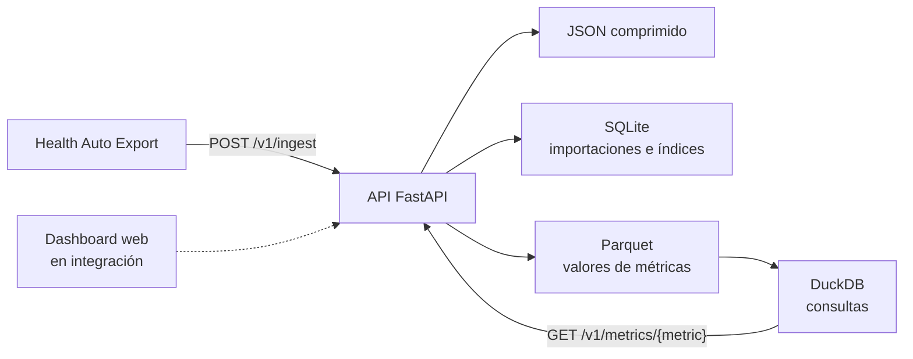

# Apple Health

Dashboard privado para recibir, conservar y analizar métricas consolidadas de
la app Salud (Apple Health) exportadas mediante Health Auto Export.

El proyecto está pensado inicialmente para una persona, una Raspberry Pi 5 con
almacenamiento NVMe y acceso desde la red local. Prioriza la privacidad, la
integridad del histórico y una operación sencilla por encima de la escala
hipotética.

> [!IMPORTANT]
> Este software ofrece visualización y contexto educativo. No diagnostica,
> sustituye el criterio clínico ni debe utilizarse para tomar decisiones médicas
> urgentes.

## Estado del proyecto

El repositorio está en desarrollo activo y su migración desde una instalación
privada existente se realiza de forma incremental.

| Área | Estado en `main` |
|---|---|
| API de ingesta de Health Auto Export | Disponible |
| Persistencia e histórico de métricas | Disponible |
| Consultas autenticadas por métrica | Disponible |
| Pruebas y controles de CI | Disponibles |
| Decisiones de arquitectura | Documentadas |
| Dashboard web y despliegue con Compose | En proceso de integración |

`main` debe considerarse la fuente de verdad del código publicado. Una decisión
de arquitectura aceptada describe la dirección acordada, pero no implica que
su implementación haya finalizado.

## Funcionalidad actual

- recibe JSON v2 de Health Auto Export mediante una API FastAPI;
- protege la ingesta y las consultas con un token Bearer;
- limita el tamaño de las peticiones y valida el formato recibido;
- conserva temporalmente el JSON original comprimido;
- registra las importaciones en SQLite y evita procesar dos veces el mismo
  payload;
- normaliza fechas, unidades y detalles específicos de algunas métricas;
- conserva valores en Parquet y los consulta con DuckDB;
- selecciona la corrección más reciente de cada observación;
- expone resúmenes diarios en la zona horaria configurada;
- impide versionar secretos, exportaciones de Salud y datasets mediante CI.

## Arquitectura

La implementación publicada mantiene separadas las responsabilidades de
ingesta, metadatos y consulta analítica:



La arquitectura objetivo es un monolito modular desplegado con Docker Compose.
El almacén operacional será la fuente autoritativa; Parquet y DuckDB quedarán
como capa analítica derivada cuando el volumen medido lo justifique. La
justificación, los límites y la estrategia de evolución están en
[la documentación de arquitectura](docs/architecture/README.md).

## Requisitos para desarrollo

- Python 3.12 o posterior;
- un sistema compatible con las dependencias de `pyarrow` y DuckDB;
- Git.

El dashboard incorporará Node.js cuando se integre en `main`. Hasta entonces,
el repositorio publicado no requiere instalar dependencias de frontend.

## Arranque local de la API

1. Crea y activa un entorno virtual:

   ```bash
   python3 -m venv .venv
   source .venv/bin/activate
   ```

2. Instala la aplicación y sus dependencias de prueba:

   ```bash
   python -m pip install --upgrade pip
   python -m pip install -e ".[test]"
   ```

3. Define una credencial efímera y un directorio de datos fuera del
   repositorio:

   ```bash
   export HEALTH_API_TOKEN="$(python -c 'import secrets; print(secrets.token_hex(32))')"
   export HEALTH_DATA_DIR="/tmp/apple-health-dev-data"
   ```

4. Inicia el servicio solo en la interfaz local:

   ```bash
   uvicorn src.app:app --host 127.0.0.1 --port 8787
   ```

5. Comprueba el endpoint público de salud:

   ```bash
   curl --fail http://127.0.0.1:8787/health
   ```

Los comandos anteriores son para desarrollo. No describen todavía el
despliegue persistente de la Raspberry Pi.

## API

| Método y ruta | Autenticación | Propósito |
|---|---|---|
| `GET /health` | No | Comprobar que el proceso responde |
| `POST /v1/ingest` | Bearer | Importar un payload JSON v2 |
| `GET /v1/status` | Bearer | Consultar importaciones y último estado |
| `GET /v1/metrics/{metric}?days=N` | Bearer | Obtener el resumen diario de una métrica |

Ejemplo de consulta autenticada:

```bash
curl \
  --fail-with-body \
  -H "Authorization: Bearer ${HEALTH_API_TOKEN}" \
  "http://127.0.0.1:8787/v1/metrics/step_count?days=30"
```

El ejemplo de payload de
[Health Auto Export](examples/health-auto-export-v2.json) contiene únicamente
datos sintéticos.

## Configuración

| Variable | Valor por defecto | Uso |
|---|---|---|
| `HEALTH_API_TOKEN` | Sin valor | Token de al menos 32 caracteres |
| `HEALTH_API_TOKEN_FILE` | Sin valor | Archivo que contiene el token; tiene prioridad sobre la variable directa |
| `HEALTH_DATA_DIR` | `/data` | Raíz del almacenamiento persistente |
| `HEALTH_TIMEZONE` | `Europe/Madrid` | Zona horaria para agrupar observaciones por día |
| `MAX_BODY_MB` | `128` | Tamaño máximo de una petición de ingesta |
| `RAW_RETENTION_DAYS` | `30` | Retención de los payloads originales comprimidos |
| `DASHBOARD_ORIGINS` | Vacío | Orígenes permitidos para consultas CORS de solo lectura |

Para un despliegue persistente, los secretos deben montarse como archivos y no
guardarse en `.env`, imágenes, comandos versionados o documentación.

## Validación

Ejecuta las mismas comprobaciones esenciales que la CI:

```bash
python -m pytest
python scripts/check_repository.py
python -m unittest scripts.test_check_repository
```

Las convenciones de ramas, commits y pull requests se documentan en
[CONTRIBUTING.md](CONTRIBUTING.md).

## Estructura del repositorio

```text
.
├── .github/              # Plantilla de PR y workflow de CI
├── docs/architecture/    # Contexto técnico y ADR
├── examples/             # Payloads sintéticos y seguros
├── scripts/              # Controles de convenciones y privacidad
├── src/                  # API y almacenamiento
└── tests/                # Pruebas automatizadas del backend
```

## Privacidad y seguridad

Los datos de salud son sensibles. No abras issues ni pull requests con datos
reales, capturas identificables, tokens, bases de datos, archivos Parquet,
backups o exportaciones de Apple Health. El repositorio contiene controles
preventivos, pero no sustituyen una revisión humana del diff.

Si una credencial se publica por error, revócala o rótala inmediatamente; no
basta con eliminarla en un commit posterior.

## Documentación

- [Arquitectura y decisiones técnicas](docs/architecture/README.md)
- [Guía de contribución](CONTRIBUTING.md)
- [Instrucciones para agentes de IA](AGENTS.md)
