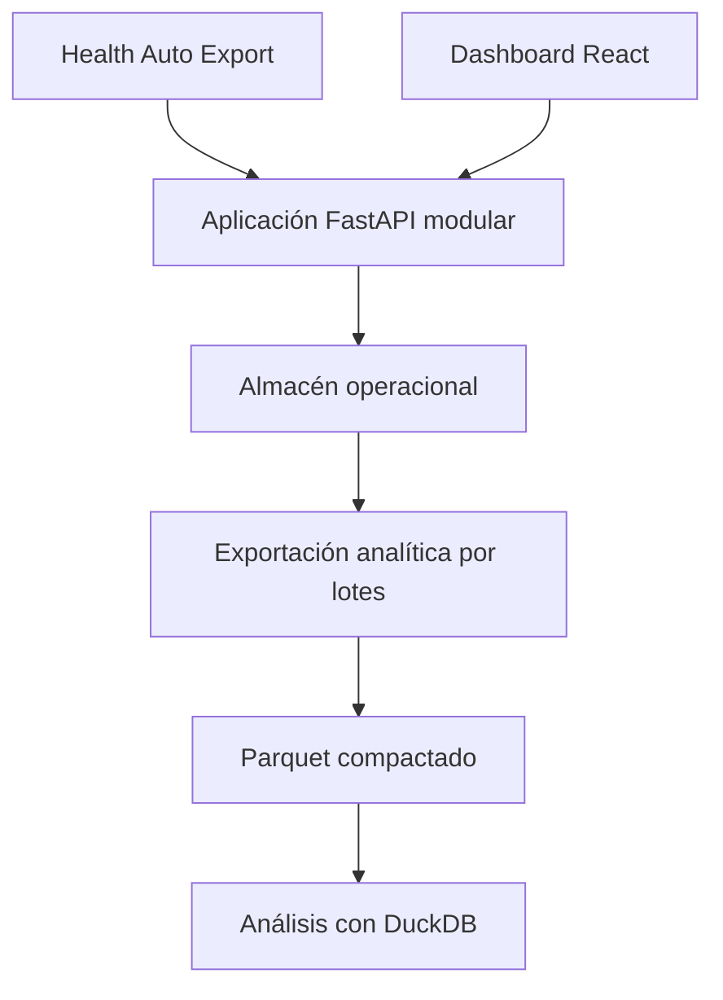

# Arquitectura de Apple Health

Este directorio describe las decisiones técnicas que condicionan la evolución
del proyecto. Su objetivo es facilitar cambios coherentes, no convertir la
documentación en una especificación exhaustiva.

Los documentos distinguen deliberadamente entre:

- el sistema que existe hoy;
- la arquitectura objetivo aceptada;
- los criterios que justificarían revisar una decisión.

Una decisión aceptada no implica que su implementación haya finalizado.

## Contexto del producto

Apple Health es un dashboard privado para recibir, conservar y analizar datos
de Apple Salud exportados mediante Health Auto Export.

El alcance confirmado actualmente es:

- un usuario y una instalación privada;
- una Raspberry Pi 5 con almacenamiento NVMe;
- acceso desde la red local;
- importaciones periódicas de métricas consolidadas;
- prioridad alta para privacidad, integridad y trazabilidad;
- posibilidad futura de incorporar usuarios y métricas adicionales, sin una
  previsión de escala o concurrencia confirmada.

La arquitectura debe resolver bien este alcance y permitir una evolución
gradual. Las hipótesis futuras no justifican por sí solas desplegar componentes
que todavía no son necesarios.

## Principios

1. **Corrección antes que sofisticación.** Un valor de salud debe poder
   relacionarse con su importación y con las correcciones recibidas después.
2. **Privacidad por defecto.** Los datos, secretos y copias de seguridad no se
   versionan ni se envían a servicios externos por defecto.
3. **La solución más simple que cubra la carga medida.** Las decisiones de
   escalado se apoyan en métricas operativas, no en escenarios hipotéticos.
4. **Monolito modular antes que servicios distribuidos.** Los límites se
   mantienen en el código y solo se separan en despliegues cuando exista una
   necesidad operativa demostrable.
5. **Almacenamiento operacional y analítico con responsabilidades distintas.**
   Las escrituras transaccionales no dependen de un formato analítico.
6. **Cambios reversibles y trazables.** Las migraciones conservan versiones,
   incluyen validación y se integran mediante pull request.
7. **Operación asumible por una sola persona.** Cada servicio adicional debe
   compensar claramente su coste de actualización, monitorización y backup.

## Arquitectura objetivo por responsabilidades

El diagrama representa responsabilidades, no servicios obligatoriamente
independientes. En la fase privada, la API y el dashboard pueden formar un
único desplegable. Parquet y DuckDB son opcionales y solo se incorporan a la
ruta analítica cuando el volumen o las consultas lo justifican.

## Evolución prevista

| Fase | Necesidad demostrada | Decisión mínima |
|---|---|---|
| Privada actual | Un usuario, carga periódica y consultas personales | Aplicación modular, un almacén operacional y Docker Compose |
| Multiusuario inicial | Usuarios autenticados y escrituras concurrentes | Incorporar identidad en el modelo y usar PostgreSQL como fuente autoritativa |
| Analítica de volumen | Escaneos históricos grandes o muestras sin resumir | Generar Parquet compactado por lotes y consultar con DuckDB |
| Escala distribuida | Límites medidos de una única instancia | Evaluar réplicas o separación selectiva del componente limitante |

No se fija un número arbitrario de usuarios como frontera. La decisión debe
considerar simultáneamente concurrencia, frecuencia de escritura, volumen por
métrica, latencia observada, recuperación y coste operativo.

## Fuera de alcance

Mientras no exista evidencia que lo requiera, quedan fuera de la arquitectura:

- microservicios;
- Kubernetes;
- colas de mensajes;
- cachés distribuidas;
- particionamiento prematuro de bases de datos;
- una partición o archivo Parquet por usuario;
- infraestructura cloud obligatoria.

## Registro de decisiones

| ADR | Estado | Decisión |
|---|---|---|
| [0001](decisions/0001-use-a-modular-monolith.md) | Aceptada | Usar un monolito modular como arquitectura de aplicación |
| [0002](decisions/0002-use-a-react-spa.md) | Aceptada | Mantener una SPA con React, Vite y Recharts |
| [0003](decisions/0003-deploy-with-compose-on-a-single-host.md) | Aceptada | Desplegar con Docker Compose en un único host |

## Mantenimiento

Una decisión debe revisarse cuando cambie una restricción relevante, aparezcan
mediciones que contradigan sus supuestos o su coste operativo supere su
beneficio. El cambio se documentará en un ADR nuevo; los documentos anteriores
se conservarán para mantener el contexto histórico.
